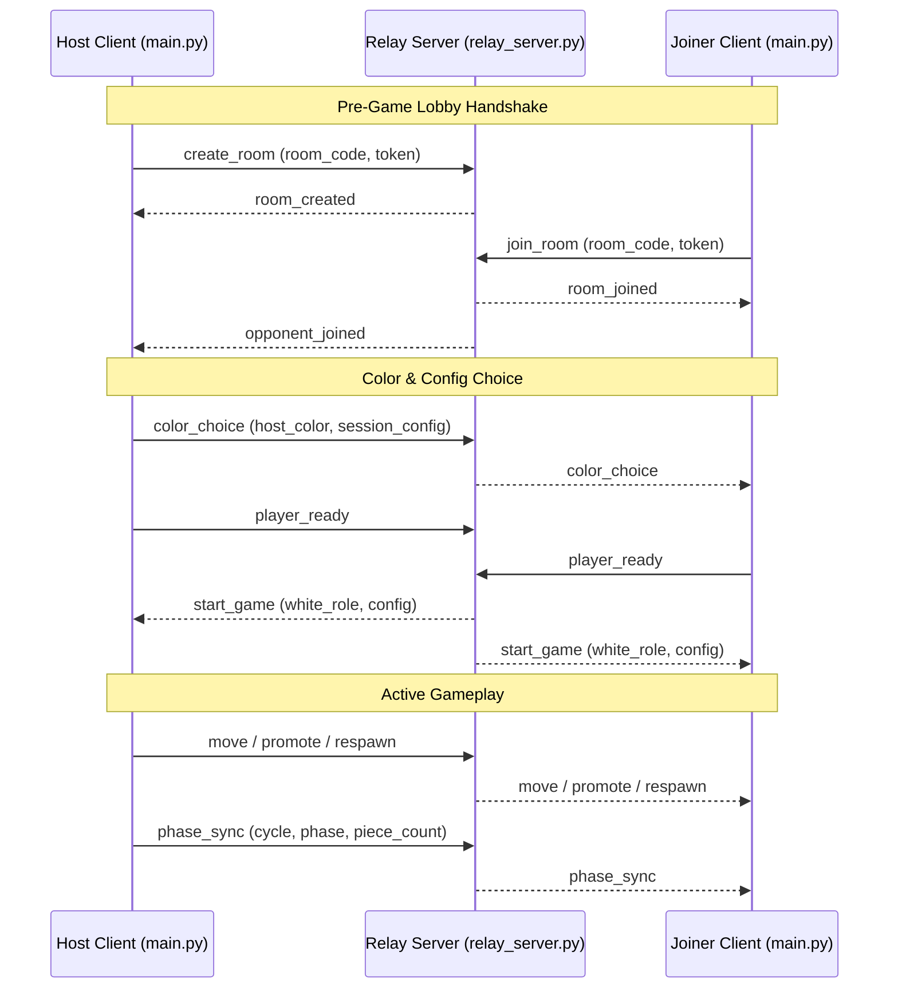

# King's Trial — Over-the-Network Play Architecture

This document details the architecture, thread model, message protocol, and state synchronization of King's Trial over-the-network multiplayer mode. It serves as a guide for debugging, maintaining, and future refactoring of the online multiplayer system.

---

## 1. Architectural Overview

King's Trial uses an **authoritative-client / thin-relay model**. Instead of running heavy game logic on a central server, the game's state and rules are evaluated entirely on the clients (the players' local machines). The central server (`relay_server.py`) acts as a lightweight message broker that handles room registry, role tracking, and message forwarding.



### Key Components

1. **`network/client.py` (`NetworkClient`)**: Encapsulates a WebSocket connection using the `websockets` library. To prevent I/O blocking from stalling Pygame's render loop, it runs in a background thread and communicates with the main thread via thread-safe queues.
2. **`scenes/online_lobby.py` (`OnlineLobbyScene`)**: Manages the pre-game lobby state machine, room creation/joining, role selection (Host vs. Joiner), color choices, and ready flags.
3. **`scenes/online_gameplay.py` (`OnlineGameplayScene`)**: Extends the standard `GameplayScene` to handle multiplayer game cycles. It disables player input when it is the remote player's turn, polls the inbound queue, executes received actions, and broadcasts local actions.
4. **`server/relay_server.py`**: A lightweight, asynchronous WebSocket relay server built with `asyncio`. It maintains active rooms, manages player presence, forwards play actions, and coordinates reconnections.
5. **`network/serialiser.py`**: Responsible for converting in-game entities (coordinates, moves, actions, full game states) to JSON-compatible dictionaries for transit, and parsing incoming JSON back into mutations on a `GameState` instance.

---

## 2. High-Level Thread Model

To guarantee a smooth, stutter-free frame rate (target: 60 FPS) in Pygame, all WebSocket read/write operations are decoupled from the main rendering thread.

```
+-------------------------------------------------------------------------------------------------+
|                                          MAIN THREAD (Pygame)                                   |
|                                                                                                 |
|   +---------------------+        dt tick (60Hz)       +------------------------------------+    |
|   |  OnlineLobbyScene   | --------------------------> |        OnlineGameplayScene         |    |
|   +---------------------+                             +------------------------------------+    |
|              |                                                           ^                      |
|      connect() / send()                                                poll()                   |
|              v                                                           |                      |
+--------------|-----------------------------------------------------------|----------------------+
               |                                                           |
               | (Thread-safe Queue)                       (Thread-safe Queue)
               v                                                           |
+--------------|-----------------------------------------------------------|----------------------+
|              v                                                           |                      |
|     +------------------+                                        +------------------+            |
|     |  _outbound queue |                                        |  _inbound queue  |            |
|     +------------------+                                        +------------------+            |
|              |                                                           ^                      |
|         get_nowait()                                                   put()                    |
|              v                                                           |                      |
|     +------------------------------------------------------------------------------+            |
|     |                         _run_loop() (Asyncio Daemon Thread)                  |            |
|     |                                                                              |            |
|     |           _sender()  ---------------------->  WebSocket Connection           |            |
|     |           _receiver() <---------------------  (websockets library)           |            |
|     +------------------------------------------------------------------------------+            |
|                                                                                                 |
|                                    DAEMON THREAD (asyncio)                                      |
+-------------------------------------------------------------------------------------------------+
```

### Thread Synchronization Mechanics
- **Queue Handlers**: The Pygame thread calls `client.poll()` once per frame. This drains the `_inbound` thread-safe queue and returns a list of received messages.
- **Background Loop**: The daemon thread runs `asyncio.run_until_complete()` on its own event loop.
- **WebSocket Send**: When `client.send(msg)` is called from Pygame, the message is placed in the `_outbound` queue. The async background loop's `_sender()` task polls this queue every 30 milliseconds and transmits pending payloads.

---

## 3. Pre-Game Lobby Flow

The pre-game lobby guides players through connection setup, matching, and color selection via a rigid state machine inside `OnlineLobbyScene`:

### Sub-screen States (`_sub`)
1. **`mode_select`**: Player chooses to either `HOST` or `JOIN`.
2. **`host_connecting` / `join_connecting`**: Establishing a connection to the WebSocket relay server.
3. **`host_waiting`**: Host is successfully registered; waiting for a Joiner to input the 6-character room code.
4. **`host_color_select`**: Opponent connected. Host chooses to play as White or Black (Joiner is assigned the opposite color).
5. **`join_waiting_color`**: Joiner is connected and waiting for the Host to declare color preferences.
6. **`host_ready_wait` / `join_ready_wait`**: A player has clicked "Ready" and is waiting for the peer's confirmation.
7. **`countdown`**: Both players are connected and ready. A 3-second visual countdown ticks down before transitioning into active gameplay.
8. **`error`**: Handles network failures, closed rooms, or bad codes.

### Connection Sequence Diagram (Pre-Game Lobby)

```
Host (Lobby)                       Relay Server                      Joiner (Lobby)
     |                                   |                                  |
     |--- (1) create_room -------------->|                                  |
     |<-- (2) room_created --------------|                                  |
     |                                   |<-- (3) join_room (with code) ----|
     |<-- (4) opponent_joined -----------|                                  |
     |                                   |--- (5) room_joined ------------->|
     |                                   |                                  |
     |--- (6) color_choice ------------->|                                  |
     |    (host_color, session_config)   |--- (7) color_choice ------------>|
     |                                   |    (host_color, session_config)  |
     |                                   |                                  |
     |--- (8) player_ready ------------->|                                  |
     |    (host_ready=True)              |<-- (9) player_ready -------------|
     |                                   |    (joiner_ready=True)           |
     |<-- (10) start_game ---------------|                                  |
     |<-- (11) start_game --------------------------------------------------|
```

---

## 4. Message Types & Protocol Specifications

All network communications use structured JSON packages. The following are the JSON schemas and descriptions of every message type defined in `network/serialiser.py` and routed by `relay_server.py`.

### 4.1. Lobby & Room Management Messages

#### `create_room` (Host → Relay)
Sent by a client attempting to host a new room.
```json
{
  "type": "create_room",
  "room": "ABC123",
  "token": "d718a36c-9457-4b71-b0db-b054a856dc3b"
}
```

#### `room_created` (Relay → Host)
Sent by the relay server confirming the room registration.
```json
{
  "type": "room_created",
  "room": "ABC123",
  "token": "d718a36c-9457-4b71-b0db-b054a856dc3b"
}
```

#### `join_room` (Joiner → Relay)
Sent by a client attempting to connect to an existing room using a code.
```json
{
  "type": "join_room",
  "room": "ABC123",
  "token": "fe8742b9-e1cf-4180-8772-246a2a095c1d"
}
```

#### `room_joined` (Relay → Joiner)
Sent by the relay confirming the Joiner was added to the room.
```json
{
  "type": "room_joined",
  "room": "ABC123",
  "token": "fe8742b9-e1cf-4180-8772-246a2a095c1d"
}
```

#### `opponent_joined` (Relay → Host)
Broadcast to the Host client as soon as a Joiner successfully connects to their room.
```json
{
  "type": "opponent_joined"
}
```

#### `color_choice` (Host → Relay → Joiner)
Dispatched by the Host to declare game settings and color choice.
```json
{
  "type": "color_choice",
  "room": "ABC123",
  "host_color": "white",
  "session_config": {
    "layout_file": "TEST_CSV.csv",
    "time_control": "5+10",
    "neutral_ai": "easy"
  }
}
```

#### `player_ready` (Player → Relay → Peer)
Sent by a client when clicking the "Ready" button in the lobby.
```json
{
  "type": "player_ready",
  "room": "ABC123",
  "role": "host",
  "host_color": "white"
}
```

#### `start_game` (Relay → Both)
Dispatched by the relay server when **both** players are flagged ready. Initiates countdown and synchronizes roles and configs.
```json
{
  "type": "start_game",
  "white_role": "host",
  "session_config": {
    "layout_file": "TEST_CSV.csv",
    "time_control": "5+10",
    "neutral_ai": "easy"
  }
}
```

---

### 4.2. Gameplay & Action Messages

#### `move` (Player → Relay → Peer)
Sent when a player performs a standard piece movement on the board.
```json
{
  "type": "move",
  "room": "ABC123",
  "from": [4, 5],
  "to": [5, 5]
}
```

#### `promote` (Player → Relay → Peer)
Sent when a player executes a promotion (upgrading a piece type using points) or demotion (upgrading/downgrading).
```json
{
  "type": "promote",
  "room": "ABC123",
  "sq": [4, 5],
  "new_type": "Q",
  "action": "promote"
}
```

#### `respawn` (Player → Relay → Peer)
Sent when a player places a captured piece back on the board from their respawn pool.
```json
{
  "type": "respawn",
  "room": "ABC123",
  "piece_type": "P",
  "target": [2, 3]
}
```

---

### 4.3. Integrity, Sync & State Recovery Messages

#### `phase_sync` (Player → Relay → Peer)
Sent by each client immediately following a local move. Serves as a lightweight integrity check to confirm that both clients have identical game cycles and piece counts.
```json
{
  "type": "phase_sync",
  "room": "ABC123",
  "cycle": 12,
  "phase": 2,
  "piece_count": 14
}
```

#### `state_snapshot` (Host → Relay → Joiner)
A complete serialization of the active `GameState` object. Dispatched by the Host to force-override the Joiner's state during a phase desynchronization or a rejoining connection.
```json
{
  "type": "state_snapshot",
  "room": "ABC123",
  "snapshot": {
    "phase": 1,
    "cycle": 14,
    "points": {
      "white": 120,
      "black": 80
    },
    "timers": {
      "white": 240.123,
      "black": 285.456,
      "neutral": 12.0
    },
    "increment_sec": 10.0,
    "board": [
      {"rank": 4, "col": 5, "type": "K", "owner": "white"},
      {"rank": 23, "col": 4, "type": "K", "owner": "black"},
      {"rank": 12, "col": 4, "type": "P", "owner": "neutral"}
    ],
    "respawn_pool": {
      "white": [{"type": "P", "owner": "white"}],
      "black": []
    },
    "king_respawn_queue": ["white", "black"],
    "game_over": false,
    "status_msg": "White to move"
  }
}
```

---

### 4.4. Disconnection & Reconnection Messages

#### `opponent_disconnected` (Relay → Active Peer)
Dispatched by the relay server when one client's WebSocket drops out unexpectedly during active play.
```json
{
  "type": "opponent_disconnected",
  "role": "host",
  "reconnect_window_sec": 60
}
```

#### `opponent_reconnected` (Relay → Active Peer)
Dispatched by the relay server when a disconnected client reconnects using their original room code and token.
```json
{
  "type": "opponent_reconnected"
}
```

#### `room_closed` (Relay → Remaining Player)
Dispatched by the relay when the room is forced shut (e.g. reconnection window expires or peer chooses to exit clean).
```json
{
  "type": "room_closed",
  "reason": "Reconnection window expired"
}
```

---

## 5. Game State Synchronization & Desync Detection

To prevent cheat vectors and state drift while keeping the network relay lightweight, King's Trial implements a **double-tiered synchronization protocol**.

### 1. Lightweight Phase Sync Checks (`phase_sync`)
Every time a local client executes a move, it applies it locally and simultaneously sends a `phase_sync` packet.
- Upon receiving a `phase_sync` packet, the peer compares the sent `cycle`, `phase`, and `piece_count` against its local `GameState`.
- If they match, the boards are assumed to be in identical sync.
- If **any** of these parameters mismatch, a **PHASE DESYNC** is declared!

### 2. State Snapshot Resolution
If a desync is detected:
- **If the local player is the HOST**: The Host immediately generates a full `state_snapshot` packet and transmits it to the Joiner.
- **If the local player is the JOINER**: The Joiner logs the desync warning and awaits the Host's incoming `state_snapshot` packet to restore structural integrity.

```
       Host (Main Loop)                               Joiner (Main Loop)
              |                                               |
       [makes local move]                                     |
              |---- (1) Send move --------------------------->|
              |---- (2) Send phase_sync --------------------->|
              |                                        [applies move locally]
              |                                        [validates phase_sync]
              |                                               |
              |                     IF MATCH:                 |
              |                     [Continue normal play]    |
              |                                               |
              |<=== (3) Trigger desync notification (if fail) | (Desync Detected!)
              |                                               |
       [generates full snapshot]                              |
              |---- (4) Send state_snapshot ----------------->|
              |                                        [applies state_snapshot]
              |                                        [Sync restored!]
```

### 3. Neutral AI Execution Authority
To prevent dual AI execution paths from diverging, **the Neutral AI engine runs only on the Host client**.
- When the current turn owner is `"neutral"`, the Host's `OnlineGameplayScene` runs `_handle_ai_logic()`.
- Once the Neutral AI determines a legal move, it applies it locally and broadcasts the move (and phase sync) via the WebSocket client using `_broadcast_ai_move()`.
- The Joiner client blocks all AI updates and simply waits to receive and apply the Neutral moves forwarded by the relay server.

---

## 6. Reconnection and Error Handling

King's Trial accounts for flaky network connections during competitive gameplay with a custom **reconnection handshake**:

1. **Daemon Auto-Reconnect**: If the TCP connection is severed, `NetworkClient` enters a status of `STATUS_RECONNECTING`. It implements an exponential backoff retry loop (starting at 1 second, doubling up to a maximum of 30 seconds) attempting to rebuild the socket connection.
2. **State Freeze**: When the socket disconnects, the relay server immediately notices the socket termination. It dispatches a message of type `opponent_disconnected` to the remaining player.
   - If the **Host** disconnected, the **Joiner's** timers and clocks are frozen immediately to keep the match fair.
   - If the **Joiner** disconnected, the **Host's** timers are frozen.
   - A visual overlay banner is rendered showing a 60-second countdown reconnect window.
3. **Reconnection Handshake**: The rejoining client connects using `ReconnectClient` (a subclass of `NetworkClient`). It transmits an initial handshake of type `reconnect` rather than `join_room`, supplying the original room code and token.
4. **Instant State Resync**: When the relay accepts the reconnection, it updates the WebSocket handle and sends `opponent_reconnected` to the active peer.
   - **Host Reconnected**: The Host receives a status update, freezes the UI countdown, and continues.
   - **Joiner Reconnected**: The Joiner connects. To ensure the Joiner client gets up-to-speed instantly (accounting for any clock adjustments or moves that happened right before the drop), **the Host immediately sends a full `state_snapshot` packet** as soon as they receive the `opponent_reconnected` signal.
5. **Graceful Termination**: If the 60-second timer expires before the disconnected player returns, the room is dismantled, the remaining player is notified with `room_closed`, and they are returned safely to the main menu.

---

## 7. Troubleshooting and Debugging Guide

When debugging network synchronization or network connectivity issues:

### Useful Logging Categories
- `KingsTrial.network`: Tracks WebSocket daemon thread status, connection attempts, backoffs, and raw sends/receives.
- `KingsTrial.online_lobby`: Pre-game lobby scene state transitions, mouse clicks, and ready states.
- `KingsTrial.online_gameplay`: Inbound message dispatching, opponent drop detections, and AI broadcasts.
- `KingsTrial.serialiser`: Logs parsed actions, state snapshot applications, and phase desync warnings.

### Common Failure Modes & Solutions

#### 1. Color Selection is Reversed on Game Start
*   **Root Cause**: The relay server previously evaluated ELO setup and player colors dynamically using the triggering `player_ready` packet's ELO/color fields. If the Joiner was the last to click "Ready", their `player_ready` msg lacked `host_color`, evaluating `host_color` to `""` and causing the roles to swap on game start.
*   **Resolution**: Implemented robust server-side caching of the `host_color` in the room entry when `color_choice` or the host's `player_ready` message is received. On game start, the cached color is extracted directly from the room dictionary rather than the active packet.

#### 2. WebSocket Connection Times Out Instantly
*   **Root Cause**: Incorrect `relay_server_url` specified in settings or `config.json`.
*   **Resolution**: Check the "Relay: ..." address displayed in the bottom-center of the "Play over Web" scene. Make sure it matches the active address of the WebSocket relay server (e.g., `ws://127.0.0.1:8765` for local testing or the production address on Fly.io).

#### 3. Board Pieces "Teleport" or Desynchronize During Active Play
*   **Root Cause**: A desync occurred due to inconsistent frame rates or packets arriving out-of-order, or an unhandled exception in one player's local `GameplayScene` engine prevented their `GameState` from advancing.
*   **Resolution**: Check the logs of both clients for a `PHASE DESYNC detected!` warning. The Host logs should indicate `apply_message: state snapshot applied`, indicating that the snapshot-driven auto-resync succeeded. If the desync repeats, check if there is an unhandled exception in `move_validator.py` that occurred on one machine but not the other.
